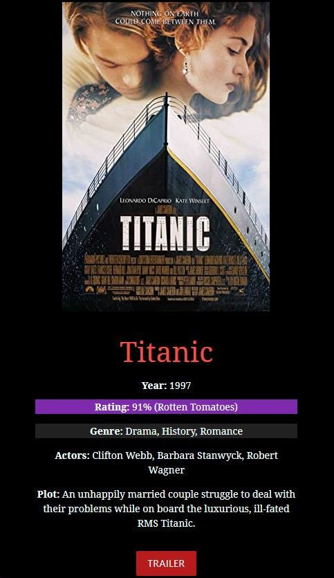
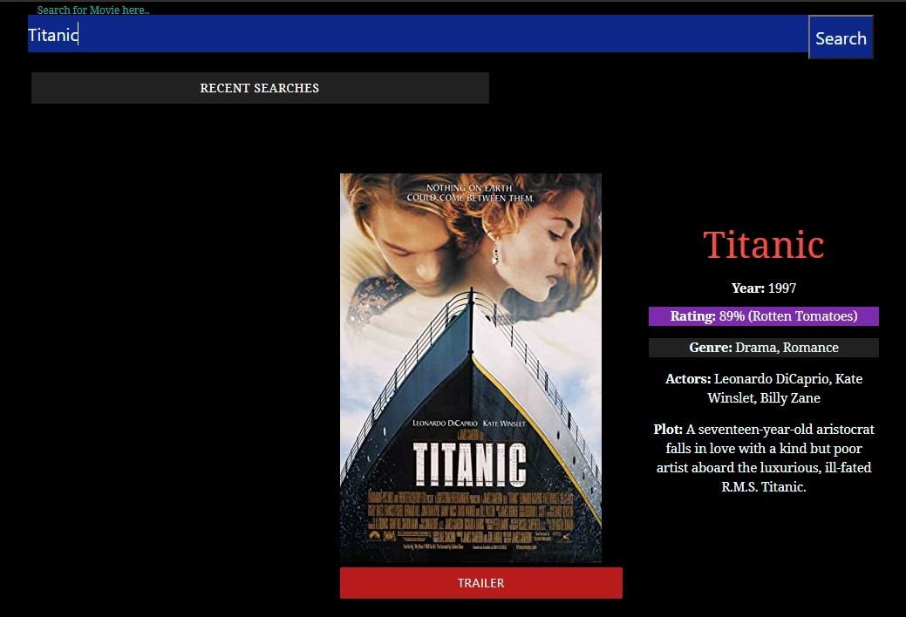
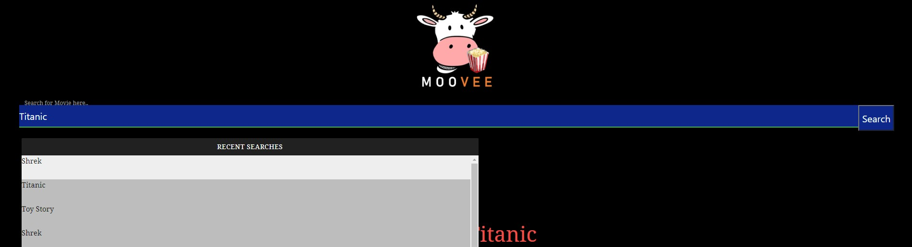
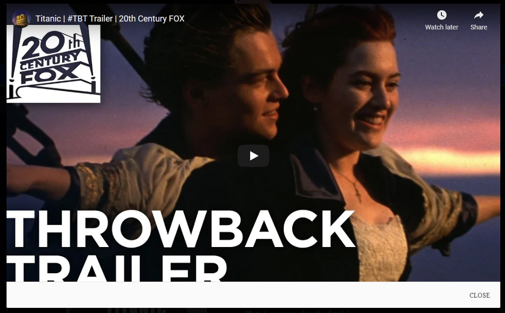

# MOOVEE

  

 

## Description

We made this app to allow users to select and watch trailers of movies that they like.

While making the app, we learned to collaborate, and how to work with APIs, working with design libraries (Materialize) and responsive design, GitHub Pull Requests and Projects, Merge Conflicts, the Command Line / Terminal, tickets and issues, DOM traversal and manipulation.

### User Story

```
AS A busy movie watcher,
I WANT to search for upcoming movies, based on my preferences,
SO THAT I can watch movies that I like.
```

## Table of Contents

-  [Usage](#usage)
-  [Screenshots](#screenshots)
-  [Documentation](#documentation)
-  [Credits](#credits)
-  [License](#license)

## Usage

To access the app, please open [MOOVEE](https://umairkhalid.github.io/movie-planner/) in Chrome or Safari.

## Screenshots

### Screenshot of MOOVEE with Search Result





### Screenshot of MOOVEE with Recent Searches



### Screenshot of MOOVEE with Modal Popup



## Documentation

-  API

   -  [YouTube Data API](https://developers.google.com/youtube/v3/docs/search/list)
   -  [The Open Movie Database API](https://www.omdbapi.com/)
   -  [Iframe Player parameters](https://developers.google.com/youtube/player_parameters)

-  Materialize

   -  CSS Framework
      -  [Color](https://materializecss.com/color.html)
      -  [Buttons](https://materializecss.com/buttons.html)
      -  [Text Inputs](https://materializecss.com/text-inputs.html)
      -  [Preload](https://materializecss.com/preloader.html)
   -  JS Framework
      -  [Modal](https://materializecss.com/modals.html)
      -  [Dropdown](https://materializecss.com/dropdown.html)

-  Fonts
   -  [Noto Serif](https://fonts.google.com/noto/specimen/Noto+Serif)

## Credits

| Contributors                             | Roles                       | Tasks                    |
| ---------------------------------------- | --------------------------- | ------------------------ |
| Umair Khalid tyfoniacrage.x.au@gmail.com | Project Manager / Developer | Rendering, Design        |
| Elsie Lawrie elsiemaylawrie1@gmail.com   | Developer                   | Rendering, Design        |
| Xuan Huy Bui huybuixuan87@gmail.com      | Developer                   | Rendering, Local Storage |
| Leo Wong leoelicos@gmail.com             | Developer                   | APIs                     |

-  API Guides
   -  [YouTube Video: OMDB API Project](https://www.youtube.com/watch?v=0PNYQFaht8c)
   -  [YouTube Video: OMDB API Movie Search App](https://www.youtube.com/watch?v=1VjdxCTBfUI)
   -  [Atlassian Tutorial on Git Checkout](https://www.atlassian.com/git/tutorials/using-branches/git-checkout)
-  [Working in Branches](https://thenewstack.io/dont-mess-with-the-master-working-with-branches-in-git-and-github/)

## License

Licensed under the [MIT License](./LICENSE).

---
